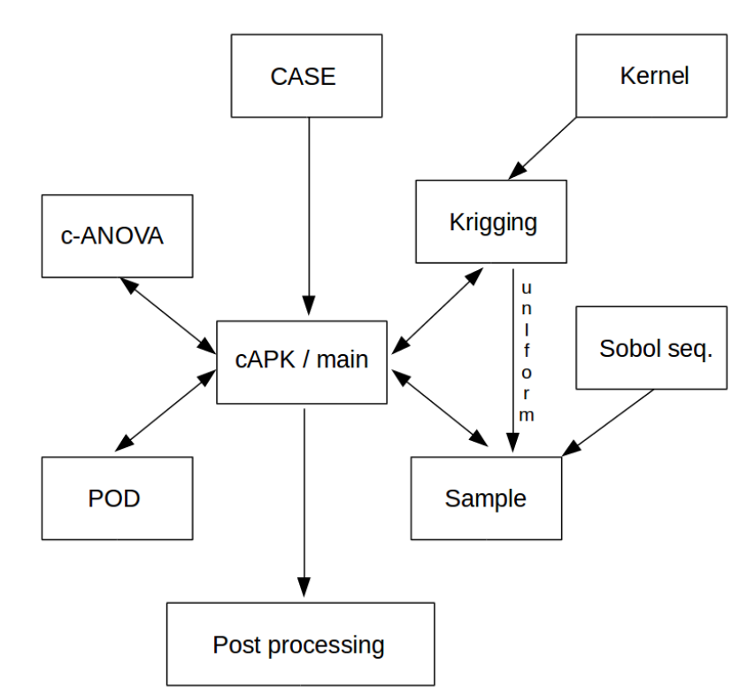

# PyUQ : Uncertainty Quantification and Data Assimilation - A Python library


### Introduction

PyUQ is a python library for uncertainty quantifcation and data assimilation, combining the features of c-ANOVA, POD and Krigging. 

Sensitivty analysis is performed using Sobol indices, and sampling via Sobal sequence

This is library was developed during the author's time at M2P2 Lab, France under supervision of Prof. Pierre Sagaut.  

### Features

* anchored-ANOVA (c-ANOVA)
* Krigging (Gaussian Process)
* Proper Orthogonal Basis (POD)
* Sobol Indices
* Sampling via Sobal sequence

### Software architecture

<p align="center">
  <a href="https://mehta-pavan.github.io/PyUQ/" target="_blank" >
    
  </a>
</p>


### Author(s) / Developer(s)

* Pavan Pranjivan Mehta, 
	  Email : pavan.mehta@sissa.it
	  Web : https://www.pavanpmehta.com/


### Documentation


Please read the PDF provided within the directory `capk`

```
https://github.com/mehta-pavan/PyUQ/tree/master/capk
```
API reference

```
https://mehta-pavan.github.io/PyUQ/
```

### Tutorial

Please find the tutorial file

```
https://github.com/mehta-pavan/PyUQ/tree/master/tutorial
```

### License
**PyUQ** is freely available under the GNU LESSER GENERAL PUBLIC LICENSE Version 2.1.
